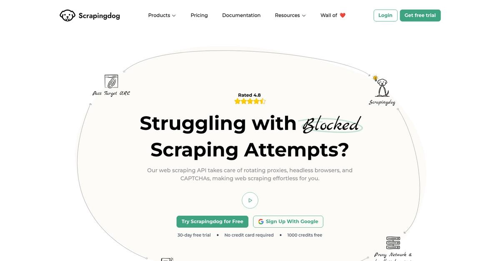
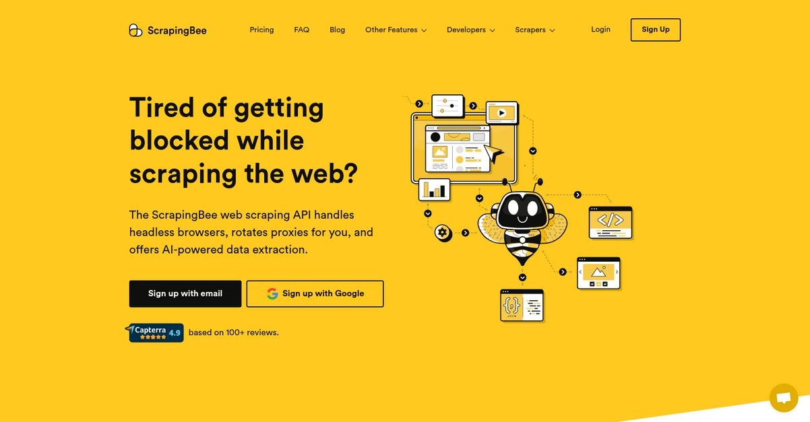
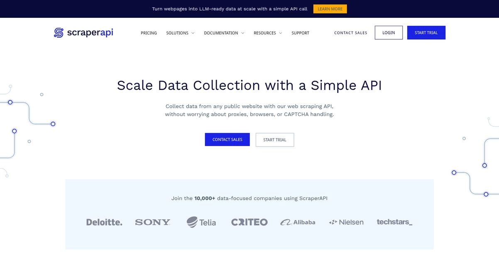
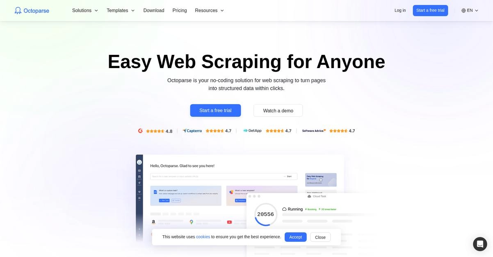
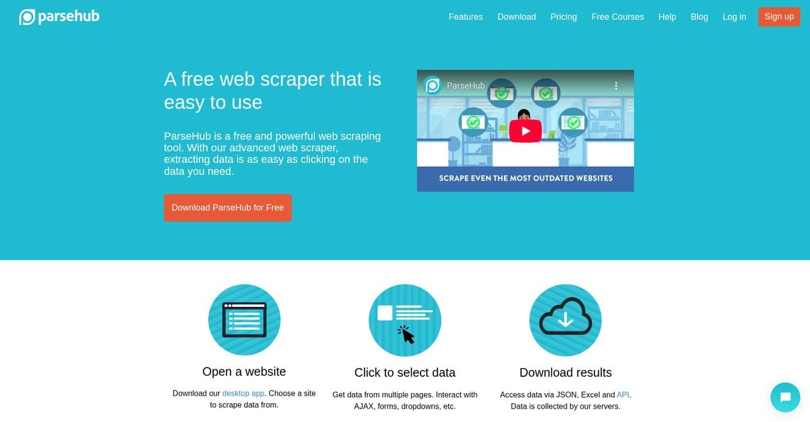
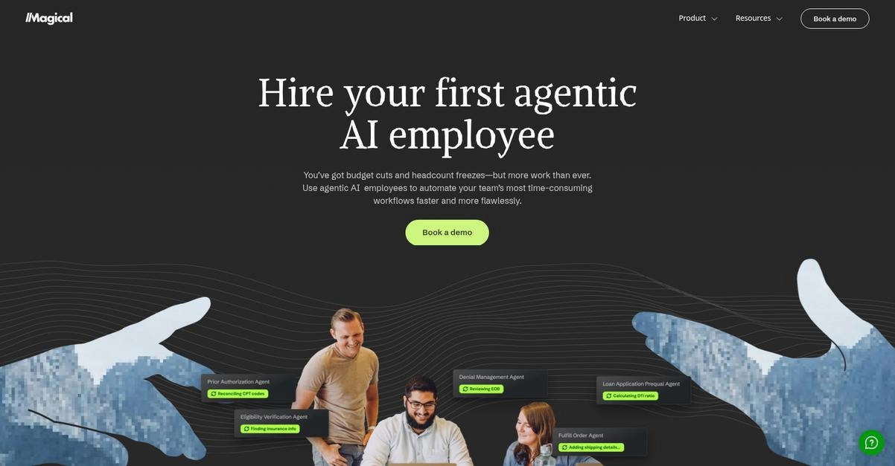
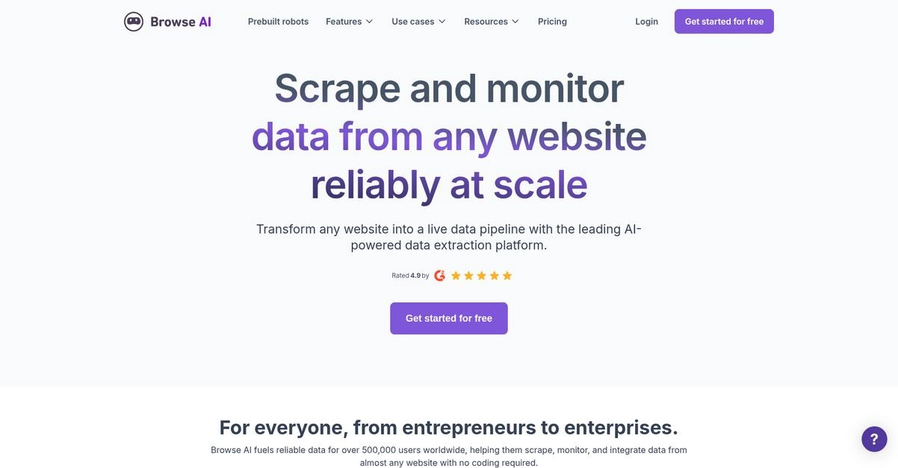

# 解锁市场数据的7+款最佳网络爬虫工具

---

还在为提取关键市场数据而头疼？

你可能花了好几个小时手动收集竞争对手的价格或客户反馈,结果拿到的信息不仅不完整,还经常没什么用。真正的问题是:**你的市场洞察总是慢人一步**,根本没法及时应对新趋势或竞争对手的动作。

而且这个挑战还在加剧。研究显示,现在有43%的企业网站都部署了反机器人措施,这让你的团队想要可靠地提取数据变得异常困难。

但用对工具就能绕过这些封锁,让你**自动化大规模数据收集**,轻松获得需要的市场洞察,没有任何麻烦。

接下来,我会带你看看目前市面上最好的网络爬虫工具。我们会找到最适合你团队需求和预算的完美解决方案。

你会发现如何持续解锁竞争对手定价、监控客户评论、识别关键市场趋势——全部自动进行。

---

## 1. Scrapingdog

网络爬虫是不是正在拖你市场研究的后腿?

Scrapingdog通过API简化了数据提取,处理无头浏览器、轮换代理和验证码。这意味着你可以专注于洞察,而不是克服技术障碍。

更重要的是,它能让你抓取那些用JavaScript渲染数据的网站——这对现代网页内容至关重要,能让你**轻松从任何想要的网站抓取数据**。结果就是为你的市场洞察提供流畅、可靠的数据流。

准备好解锁你的市场数据了吗?

Scrapingdog确保成功的大规模数据收集。它拥有超过4000万个代理池,确保你绕过速率限制和封锁,持续拉取数据。

具体怎么做呢:API处理大量并发请求而不影响性能或可靠性,测试显示成功率达到100%。**这意味着为你的商业智能工具提供不间断的数据流。**

此外,Scrapingdog为Google搜索、亚马逊和LinkedIn等特定平台提供专用API,直接提供解析的JSON数据。这简化了提取竞争对手定价、产品数据或招聘洞察的过程,为你的分析甚至训练AI模型提供干净、结构化的数据。

你总能得到需要的数据。

**核心功能:**

- **自动绕过机器人检测:** Scrapingdog的API自动管理轮换代理、无头浏览器和验证码,确保你持续绕过机器人检测,实现不间断的数据收集
- **定向数据提取:** 利用针对亚马逊、LinkedIn和各种谷歌服务等特定平台的专用API,以解析的JSON格式提取精确的数据点,如定价、产品详情或搜索结果
- **LLM就绪数据:** 将任何网页转换为干净、结构化的Markdown或JSON,可立即被你的AI模型消化,剥离杂乱内容并适应布局变化,无需额外解析

**总结:** 对于寻求强大而用户友好解决方案的中型企业来说,Scrapingdog在最佳网络爬虫工具中脱颖而出。其专业的API和自动绕过机器人的能力为大量数据提取提供了100%的成功率,非常适合全面的市场研究和竞争对手分析。

---

## 2. ScrapingBee

厌倦了爬取网页时被封锁?

ScrapingBee提供网络爬取API,专为处理无头浏览器和自动轮换代理而设计。

这意味着你可以**专注于提取需要的数据**,而不用操心管理自己的基础设施。

来看看这个强大工具如何简化数据提取。

ScrapingBee管理着数千个无头Chrome浏览器实例,确保你的网页像真实用户访问一样渲染。这对于抓取用JavaScript框架构建的现代网站至关重要。

此外,他们庞大的代理池确保你能**绕过速率限制并减少被封锁的机会**,实现持续、不间断的数据流。你还可以渲染JavaScript来抓取任何网站,甚至是单页应用,并使用自定义JavaScript片段进行特定交互。另外,AI网络爬取功能让你用简单的英语描述想要的数据,适应布局变化而无需CSS选择器。

结果:为你的业务提供轻松的数据收集。

**核心功能:**

- **无头浏览器和代理管理:** 自动处理无头浏览器和轮换代理,简化复杂的爬取任务并防止封锁,让你专注于数据
- **AI驱动的数据提取:** 👉 [利用AI技术,用简单的语言描述想要的数据,自动适应网页变化](https://www.scraperapi.com/?fp_ref=coupons)
- **JavaScript渲染和场景:** 渲染JavaScript以抓取动态网站和单页应用,或运行自定义JavaScript片段来点击、滚动和与页面交互

**总结:** ScrapingBee通过解决网络爬取中最大的痛点来表现出色:封锁和复杂渲染。其自动代理轮换、无头浏览器管理和AI驱动提取使其成为中型企业寻求可靠、大规模数据收集以获取市场洞察的最佳网络爬虫工具之一。

---

## 3. ScraperAPI

还在为复杂的网络爬取而挣扎?

ScraperAPI通过简单的API调用简化数据提取,处理代理和验证码,让你轻松从公共网站收集数据。

这意味着你可以**专注于分析市场数据,而不是收集数据**。结果?不间断的数据流和减少的手动工作。

来深入了解这个解决方案。

ScraperAPI允许你为市场研究扩展数据收集,给你竞争优势。这帮助你克服实时数据捕获和合规性的挑战。

他们的结构化端点从亚马逊、谷歌和沃尔玛等热门域提供JSON数据,将网页转换为可读数据。**这意味着你只得到你关心的信息**,简化了数据分析。你还可以异步发送数百万请求,无需代码即可自动收集,处理大规模数据获取。

此外,ScraperAPI在50个国家提供超过4000万个全球代理,通过避免封锁来提升你的响应时间和成功率。他们处理代理轮换、验证码和浏览器处理,为你的团队节省宝贵的开发时间。

这为你的市场研究提供了准确的数据支持。

**核心功能:**

- **结构化数据端点:** 将网站内容转换为结构化JSON数据,让你接收精确信息,无需不必要的HTML标签或脚本
- **异步爬虫服务:** 让你异步发送数百万请求,确保大量数据收集而不牺牲效率或速度
- **数据管道:** 无需编写任何代码即可自动化数据收集,为所有技能水平简化复杂的爬取任务

**总结:** ScraperAPI非常适合寻求最佳网络爬虫工具的中型企业,提供自动化、大规模数据收集。它专注于结构化JSON数据和代理管理来简化操作,让你的团队专注于市场洞察而不是技术复杂性,确保持续的数据流。

---

## 4. Octoparse

为复杂的、需要大量代码的数据提取而挣扎?

Octoparse提供无需编码的解决方案,只需点击就能将网页转换为结构化数据。这意味着你可以可视化地构建可靠的网络爬虫。

你可以在工作流设计器中设计自己的爬虫,**在浏览器中将一切可视化,轻松设置**。这解决了需要技术专业知识的痛点。

这里有一种更简单的方法来解锁市场数据。

Octoparse解决了手动数据收集的问题,让你轻松访问大量市场洞察。你可以利用其AI网络爬取助手Auto-detect更快上手。

此外,其24/7云解决方案最大化爬取效率,允许你**为及时或灵活的数据间隔安排爬虫**。这意味着自动化大规模数据收集。

而且,你可以领先于验证码解决和IP轮换等网络爬取挑战,按你的意愿与网页元素交互。还有数百个热门网站的预设模板,为电商、潜客开发和社交媒体数据用例提供零设置的即时数据。

结果是不间断的数据流和减少的手动工作。

**核心功能:**

- **无需编码的解决方案:** 在工作流设计器中可视化构建可靠的网络爬虫,通过简单点击将网页转换为结构化数据
- **AI网络爬取助手:** 通过Auto-detect更快上手并获得及时提示,提升效率并简化复杂的爬取任务
- **24/7云自动化:** 通过安排爬虫获取及时数据来最大化爬取效率,处理IP轮换、验证码解决和灵活的数据导出

**总结:** Octoparse在最佳网络爬虫工具中脱颖而出,完美平衡了市场研究的易用性和可扩展性。其无需编码的方法、AI助手和强大的自动化功能为成长阶段的公司简化了数据收集,确保跨行业的不间断数据流和减少的手动工作。

---

## 5. ParseHub

需要轻松解锁大量网络数据?

ParseHub通过其直观的可视化界面让你从任何网站提取有价值的信息。这意味着你可以告别复杂的编码。

你可以**将非结构化的网络数据转换为有组织的格式**,如CSV、JSON或Excel,使其立即可用于分析。

你可以这样实现。

ParseHub能够从动态网站精确选择数据,包括那些有无限滚动、弹出窗口和JavaScript的网站。这种能力确保你捕获所有需要的数据。

你还可以**安排爬取项目自动运行**,直接将新鲜数据更新接收到你的云存储或API。这消除了持续手动干预的需要。

此外,ParseHub提供IP轮换和强大的错误处理,确保即使从具有挑战性的网站也能可靠且不被检测地收集数据,因此你的数据流保持不间断。

解锁关键市场数据和洞察。

**核心功能:**

- **可视化网络爬虫:** 使用直观的点击界面从复杂的动态网站提取数据,简化你的数据收集过程
- **定时运行和API:** 将数据提取项目自动化为每小时、每天或每周运行,并通过其强大的API直接与你的系统集成
- **IP轮换和基于云:** 通过自动IP轮换确保成功、不被检测的爬取,并在他们的服务器上运行项目而不占用你自己的资源

**总结:** ParseHub是寻求自动化大规模数据收集以获取市场洞察的中型企业的最佳网络爬虫工具之一。其用户友好的可视化界面和强大功能,如定时运行、IP轮换和无缝集成,使其成为获得竞争优势的理想选择。

---

## 6. Magical

需要解锁你的市场数据和洞察?

Magical提供代理AI员工来自动化你团队最耗时的工作流程。这意味着你可以在预算削减和人员冻结的情况下仍然完成更多工作。

以下是它如何解决你识别可扩展、易于使用的市场研究工具的挑战:Magical使工作流程自动化**自我驱动,不像僵化的传统RPA**。

超越手动数据收集瓶颈。

Magical帮助你在几天内(而不是几个月)开始自动化,通过本地运行的一键自动化。结果是超过50%的效率提升,作为代理AI的训练场。

此外,Magical的AI观察你团队的工作流程,**自动为你标记自动化机会**。你还可以提交自己的SOP或记录任何工作流程立即开始。另外,你可以雇用在你睡觉时工作的AI员工,做出智能决策。这确保了完全自主、可扩展的数据收集。

解锁数据,减少工作量,并保持合规。

**核心功能:**

- **代理AI员工:** 更快、更完美地自动化耗时的工作流程,以应对预算削减和人员冻结
- **一键自动化:** 在几天内开始自动化,将效率提升超过50%,并为高级任务训练代理AI
- **自主模式:** 雇用在你睡觉时工作的AI员工,在每个自动化中做出智能决策以实现可扩展性

**总结:** Magical通过提供代理AI来自动化复杂工作流程,在最佳网络爬虫工具中脱颖而出。其观察低效率并提供一键自动化的能力使其成为中型企业寻求高效、可扩展数据收集解决方案的理想选择,无需大量构建时间,确保不间断的数据流。

---

## 7. Browse AI

为市场洞察的复杂数据提取而挣扎?

Browse AI让你的团队无需任何编码,只需指向和点击就能从任何网站提取数据。这意味着你可以轻松收集产品数据、监控竞争对手,甚至将任何网站变成实时电子表格。**你甚至可以以人类般的精度自动化复杂的工作流程。**

以下是如何解锁关键市场数据。

Browse AI让你将任何网站转换为实时数据管道。你可以轻松提取、监控和集成数据。

该平台提供AI驱动的网站布局监控,即使网站发生变化也能确保你的数据保持准确。**这种自我修复能力防止爬虫损坏**。你还可以安排数据提取任务,并在网站发生变化时接收通知。此外,Browse AI支持深度爬取以从页面和子页面提取数据,处理分页,并解决验证码。它为无限规模而构建,能够同时处理多达50万个页面,并与超过7000个应用集成。

收集你需要的市场情报。

**核心功能:**

- **AI驱动的点击数据提取** 让你轻松从任何网站提取数据而无需编码,确保所有用户无论技术技能如何都能访问
- **自动网站监控** 检测布局变化并持续更新你的数据,以最少的手动工作提供可靠、最新的市场情报
- **与7000多个应用无缝集成** 包括Google Sheets、Airtable和Zapier,让你立即将提取的数据连接到现有的业务工具

**总结:** Browse AI提供强大、用户友好的解决方案,使其成为需要可靠、可扩展数据提取的中型企业的最佳网络爬虫工具之一。其无需编码的界面、AI驱动的监控和广泛的集成非常适合高效捕获竞争对手价格或生成潜在客户。

---

## 结语

还在为获得可靠的市场数据而挣扎?

选择合适的工具确实让人头疼。很多解决方案要么无法绕过现代反机器人措施,要么需要深厚的技术专业知识,导致你的洞察不完整。

好消息是成功是可能的。Thunderbit的一份报告显示,通过正确的实施可以实现>99%的成功率。**这种可靠性水平对于构建准确的市场情报是不可或缺的。**

那么,最佳选择是什么?

经过我的评测,Scrapingdog是明显的赢家。它为你处理所有技术障碍——代理、浏览器和验证码——每次都能提供干净的数据。

我喜欢的是它在测试中100%的成功率,确保你避免封锁。当你使用像Scrapingdog这样的最佳网络爬虫工具时,你会获得不间断的数据流。

我强烈建议你试试 👉 [开启ScraperAPI免费试用,从第一天起就体验它如何简化整个过程](https://www.scraperapi.com/?fp_ref=coupons)。
